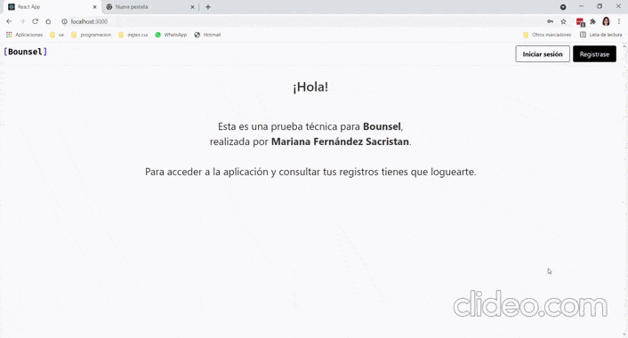

<h1 align="center" >Frontend timeRecord</h1>

 
 
 

:speech_balloon: [About](#id1)   

:hammer: [Tools](#id2)

:clipboard: [Frontend](#id3)

---

## **About**

Frontend correspondiente a una prueba técnica de Bounsel.

Agregar la funcionalidad nueva a una aplicación para que registre el tiempo de conexión de un usuario, desde el login hasta el logout o el cierre del browser.

Condiciones:

* Solo una llamada a la API para obtener los registros.
* Los registros de un usuario se deben buscar entre dos fechas.
* Se deben ver los registros en el Frontend.

---

**Start date:** 06 / 08 /2021
**Deadline:** 08 / 08 / 2021

**Contributors:**
* [Mariana Fernández Sacristán](https://github.com/mlfernandez)

---

## **Tools**

To create this project we worked with these tools and technologies:

|  | Visual Studio Code |

|  | JavaScript | 

|  | NODE JS & EXPRESS |

|  | AXIOS | 

|  | Git |

|  | GitHub | 

|  | React | 

|  | Redux | 

|  | Sequelize | 

|  | Sass | 

***
## **Frontend**
   

Usuario login:
email: mariana@gmail.com
password: 123456

[UP](#top)